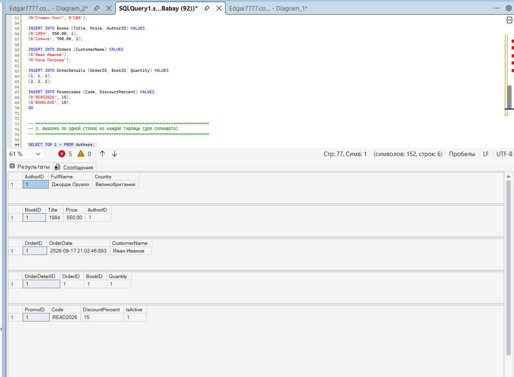
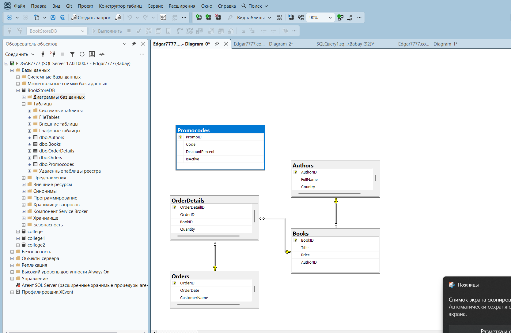

** дз 17.09 **

Вам нужно создать собственную базу данных с 5 и более таблиц, каждая из которых связана с другой, кроме 1

Достаньте от туда 1 строчку из каждой таблицы с помощью T-SQL

загрузите бд на репозиторий вместе с фото диаграммой бд и скрином где показаЫын вывод строк

1) С ЧЕГО МЫ НАЧНЕМ ПРАВИЛЬНО С СОЗДАНИЕМ БД

2)с 5 и более таблиц, каждая из которых связана с другой, кроме 1

CREATE DATABASE BookStoreDB;
GO

USE BookStoreDB;
GO

-- Таблица 1: Авторы (Связанная)
CREATE TABLE Authors (
    AuthorID INT PRIMARY KEY IDENTITY(1,1),
    FullName NVARCHAR(100) NOT NULL,
    Country NVARCHAR(50)
);

-- Таблица 2: Книги (Связанная с Авторами)
CREATE TABLE Books (
    BookID INT PRIMARY KEY IDENTITY(1,1),
    Title NVARCHAR(150) NOT NULL,
    Price DECIMAL(10, 2) NOT NULL,
    AuthorID INT FOREIGN KEY REFERENCES Authors(AuthorID)
);

-- Таблица 3: Заказы (Связанная)
CREATE TABLE Orders (
    OrderID INT PRIMARY KEY IDENTITY(1,1),
    OrderDate DATETIME DEFAULT GETDATE(),
    CustomerName NVARCHAR(100) NOT NULL
);

-- Таблица 4: Детали заказа (Связывает Книги и Заказы)
CREATE TABLE OrderDetails (
    OrderDetailID INT PRIMARY KEY IDENTITY(1,1),
    OrderID INT FOREIGN KEY REFERENCES Orders(OrderID),
    BookID INT FOREIGN KEY REFERENCES Books(BookID),
    Quantity INT NOT NULL
);

-- Таблица 5: Промокоды (Изолированная таблица БЕЗ связей)
CREATE TABLE Promocodes (
    PromoID INT PRIMARY KEY IDENTITY(1,1),
    Code NVARCHAR(20) UNIQUE NOT NULL,
    DiscountPercent INT NOT NULL,
    IsActive BIT DEFAULT 1
);
GO

3) НАПОЛНЕНИЕ ТЕСТОВЫМИ ДАННЫМИ

INSERT INTO Authors (FullName, Country) VALUES 
(N'Джордж Оруэлл', N'Великобритания'),
(N'Стивен Кинг', N'США');

INSERT INTO Books (Title, Price, AuthorID) VALUES 
(N'1984', 550.00, 1),
(N'Сияние', 700.00, 2);

INSERT INTO Orders (CustomerName) VALUES 
(N'Иван Иванов'),
(N'Анна Петрова');

INSERT INTO OrderDetails (OrderID, BookID, Quantity) VALUES 
(1, 1, 1),
(2, 2, 2);

INSERT INTO Promocodes (Code, DiscountPercent) VALUES 
(N'READ2026', 15),
(N'BOOKLOVE', 10);
GO

4) ВЫБОРКА ПО ОДНОЙ СТРОКЕ ИЗ КАЖДОЙ ТАБЛИЦЫ

SELECT TOP 1 * FROM Authors;
SELECT TOP 1 * FROM Books;
SELECT TOP 1 * FROM Orders;
SELECT TOP 1 * FROM OrderDetails;
SELECT TOP 1 * FROM Promocodes;
GO

что же у нас получилось???
-

диаграмма

*файл с бд прикрепил в папку*
